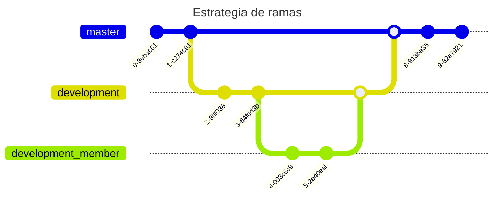

# Proyecto #2 Técnicas de programación

## ECONATURA

Este proyecto implementa un sistema de automatización de los trámites necesarios para obtener algunos tipos de licencias ambientales ante la autoridad ambiental del departamento de Antioquia (CORANTIOQUIA). Los tipos de licencias que se automatizan son los siguientes:

## Recursos hidrícos  🌊🌊
* Ocupación de causes
* Conseción de aguas superficiales 
* Conseción de aguas subterráneas

## Recursos Forestales 🌲🌳
* Aprovechamiento de cerco vivo
* Investigación
* Aprovechamiento forestal

## Características técnicas

Este proyecto ha sido realizado empleando JAVA ☕ en su versión 21 así JAVAFX en su versión 21

### WORKFLOW
A continuación se presenta una imagen con el esquema del proyecto



# Migraciones

Ejecutar las migraciones localizadas en `src/main/resources/db/migration`

```shell
mvn clean flyway:migrate
```
En ocaciones, es necesario borrar la base de datos antes de ejecutar las migraciones para realizar esta acción,
ejecute el siguiente comando:

```shell
mvn clean flyway:clean
```

En el caso que los comandos anteriores no le funcionen también puede intentar con estas versiones.

Para eliminar la base de datos 

```shell
./mvnw clean flyway:clean
```

Para ejecutar las migraciones

```shell
./mvnw clean flyway:migrate
```

Para crear una nueva migración el estandar de nombre es el Siguiente

`<Prefix><Version>__<Description>.sql`

Prefix es `V` para las migraciones hacia adelante
Version es el numero de versión a aplicar
Description: es la descripción del cambio, se separa de la versión por 2 `_`
